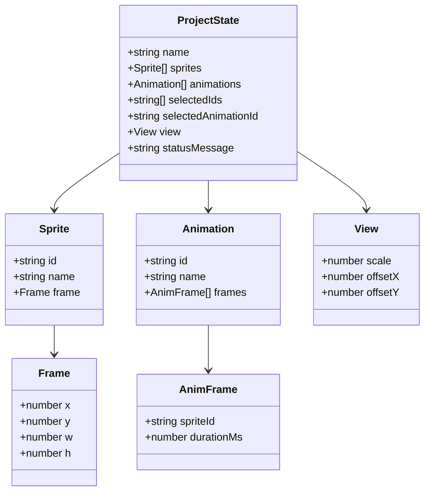

# UML 类图草案（逻辑模型 / Mermaid）

```mermaid
classDiagram
  class Sprite {
    +string id
    +string name
    +Frame frame
  }
  class Frame {
    +number x
    +number y
    +number w
    +number h
  }
  class Animation {
    +string id
    +string name
    +AnimFrame[] frames
  }
  class AnimFrame {
    +string spriteId
    +number durationMs
  }
  class ProjectState {
    +string name
    +Sprite[] sprites
    +Animation[] animations
    +string[] selectedIds
    +string selectedAnimationId
    +View view
    +string statusMessage
  }
  class View {
    +number scale
    +number offsetX
    +number offsetY
  }
  Sprite --> Frame
  Animation --> AnimFrame
  ProjectState --> Sprite
  ProjectState --> Animation
  ProjectState --> View
```
