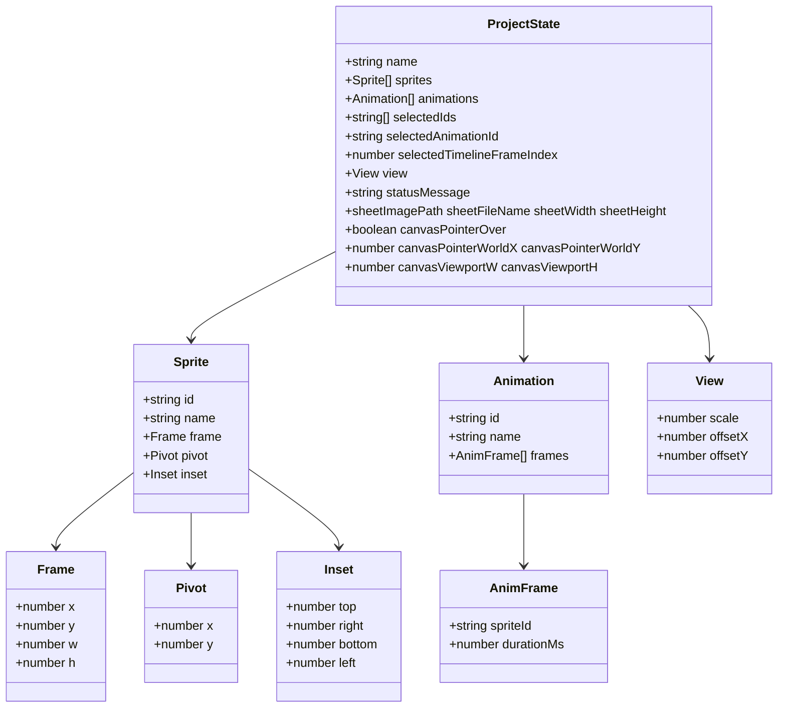

# UML 类图草案（逻辑模型 / Mermaid）

```mermaid
classDiagram
  class Sprite {
    +string id
    +string name
    +Frame frame
    +Pivot pivot
    +Inset inset
  }
  class Frame {
    +number x
    +number y
    +number w
    +number h
  }
  class Pivot {
    +number x
    +number y
  }
  class Inset {
    +number top
    +number right
    +number bottom
    +number left
  }
  class Animation {
    +string id
    +string name
    +AnimFrame[] frames
  }
  class AnimFrame {
    +string spriteId
    +number durationMs
  }
  class ProjectState {
    +string name
    +Sprite[] sprites
    +Animation[] animations
    +string[] selectedIds
    +string selectedAnimationId
    +number selectedTimelineFrameIndex
    +View view
    +string statusMessage
    +sheetImagePath sheetFileName sheetWidth sheetHeight
    +boolean canvasPointerOver
    +number canvasPointerWorldX canvasPointerWorldY
    +number canvasViewportW canvasViewportH
  }
  class View {
    +number scale
    +number offsetX
    +number offsetY
  }
  Sprite --> Frame
  Sprite --> Pivot
  Sprite --> Inset
  Animation --> AnimFrame
  ProjectState --> Sprite
  ProjectState --> Animation
  ProjectState --> View
```

运行时 `sheetImageDataUrl` 仅存于内存用于解码显示；持久化 v2 见 `database-design.md`。
