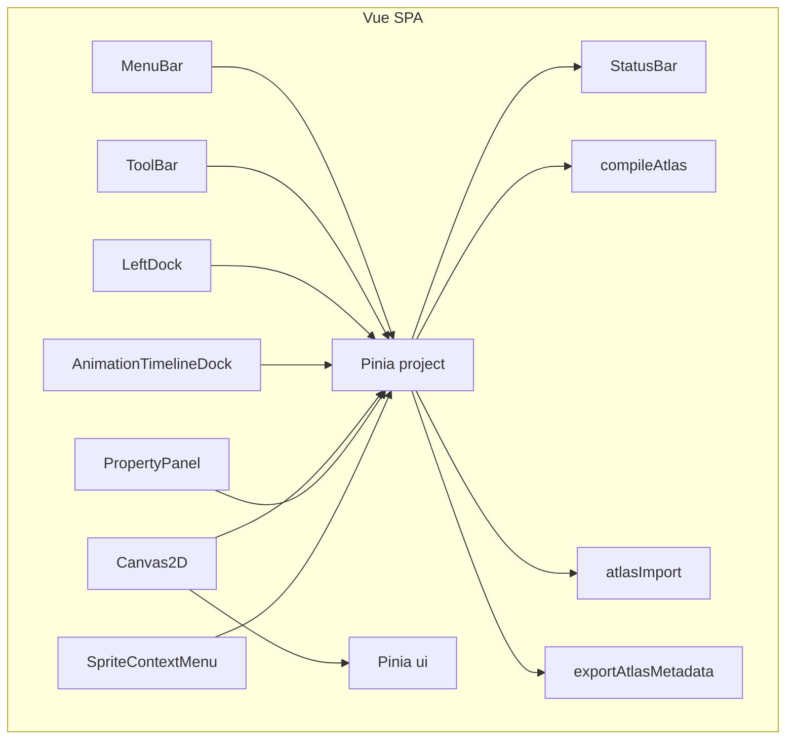

# UML 组件图（Mermaid）

```mermaid
flowchart TB
  subgraph GUI["Vue SPA"]
    MB[MenuBar]
    TB[ToolBar]
    LD[LeftDock]
    ATL[AnimationTimelineDock]
    CV[Canvas2D]
    PP[PropertyPanel]
    SCM[SpriteContextMenu]
    SB[StatusBar]
    PST[Pinia project]
    UIST[Pinia ui]
    CP[compileAtlas]
    ATLIMP[atlasImport]
    ATLMETA[exportAtlasMetadata]
  end
  MB --> PST
  TB --> PST
  LD --> PST
  ATL --> PST
  CV --> PST
  CV --> UIST
  PP --> PST
  SCM --> PST
  PST --> SB
  PST --> CP
  PST --> ATLIMP
  PST --> ATLMETA
```
