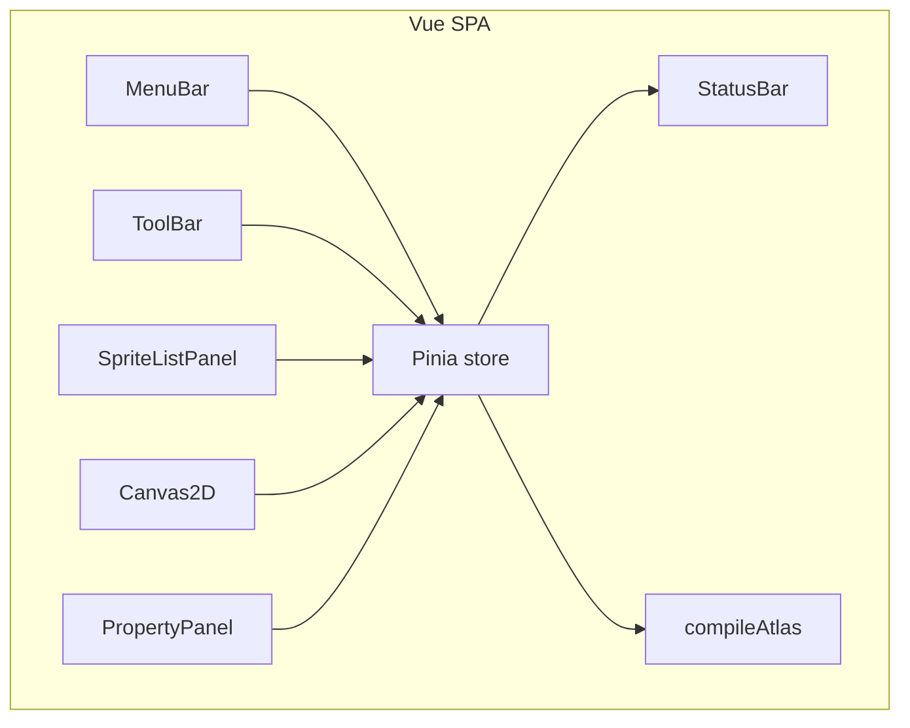

# UML 组件图（Mermaid）

```mermaid
flowchart TB
  subgraph GUI["Vue SPA"]
    MB[MenuBar]
    TB[ToolBar]
    SL[SpriteListPanel]
    CV[Canvas2D]
    PP[PropertyPanel]
    SB[StatusBar]
    ST[Pinia store]
    CP[compileAtlas]
  end
  MB --> ST
  TB --> ST
  SL --> ST
  CV --> ST
  PP --> ST
  ST --> SB
  ST --> CP
```
